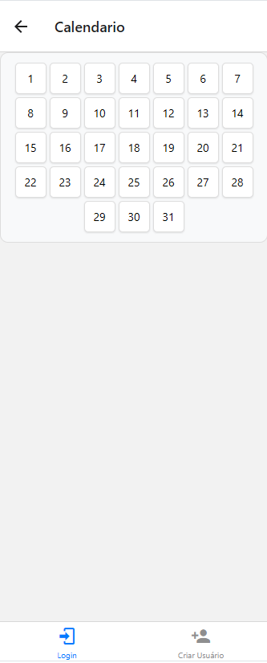

# AgendaApp

## Introdução

Projeto da disciplina de computação móvel o qual era preciso fazer um aplicativo cujo tema era livre.

## Motivação
O principal fator o qual me fez fazer um app de agenda foi que eu frequentemente uso o aplicativo do google agenda para a minha rotina. Além disso, com essa ideia poderia atingir todos os requisitos do projeto.

## Objetivo
O projeto visa contemplar os conhecimentos vistos durante todo o semestre na disciplina de computação móvel. O trabalho foi feito para que o usuário se cadastre no app e, ao efetuar o login consiga marcar tarefas com títulos, descrições e horários. Quando o horário de uma tarefa for atingido, uma tela aparecerá dizendo para fazer a tarefa. Ao clicar no "X" a tarefa é considerada concluída e é deletada do dia em que foi cadastrada.

## Funcionalidades
- **Cadastro de Usuário:** Permite que novos usuários se cadastrem no aplicativo.
- **Login:** Usuários podem fazer login para acessar o calendário.
- **Calendário:** Visualização de um mês de 31 dias onde os usuários podem selecionar um dia específico para ver ou adicionar tarefas.
- **Adicionar Tarefa:** Usuários podem adicionar novas tarefas com título, descrição e horário(formato Hr:min).
- **Editar Tarefa:** Usuários podem editar tarefas ao clicarem em uma tarefa que esteja sendo exibida.
- **Excluir Tarefa:** Usuários podem excluir tarefas ao clicarem em uma tarefa que esteja sendo exibida.
- **Notificações:** O aplicativo exibe uma nova tela para mostrar que o horário da tarefa foi atingido.

## Telas do App

### Tela de Login

### Tela de Cadastro

### Tela do Calendário

### Tela do Dia

### Tela de Adicionar Tarefa

### Tela de Exibir Tarefa

### Tela de Editar Tarefa

### Tela de Notificação

## Como Executar
Para testar o app é preciso

1. Baixar o zip do repositório.
2. Vá no site https://expo.dev/.
3. Vá na aba "snacks".
4. Clique em "New Snack".
5. Copie o conteúdo de cada arquivo e cole no seu devido lugar.
6. Selecione a opção "My device" e baixe o expo go no celular.
7. Leia o qr code da tela e teste no celular.

## Agradecimentos

Agradeço aos professores dessa disciplina que durante todo o semestre nos ensiram o conteúdo necessário para fazer este projeto. Além disso, criar pela primeira vez um app me deixou muito animado, principalmente ao testar no meu próprio celular e dar certo.

## Autor

Nathan Gabriel da Fonseca Leite
Github: https://github.com/NathanGbl